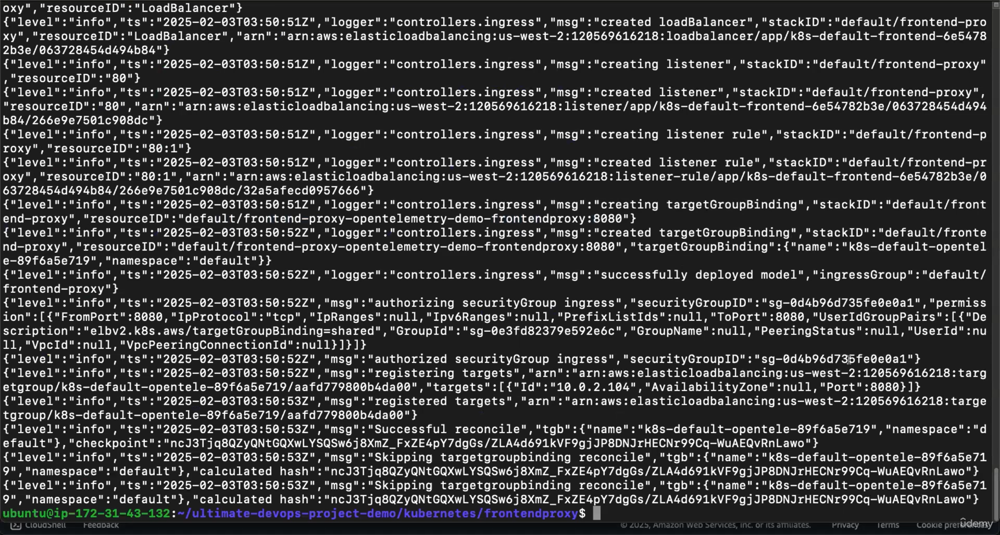

# 🛒 E-Commerce Microservices Demo with DevOps Best Practices

This repository showcases a **demo e-commerce application** designed and deployed using modern **DevOps best practices**. Inspired by the [OpenTelemetry Demo Architecture](https://opentelemetry.io/docs/demo/architecture/), this project demonstrates a robust, scalable, and observable microservices-based architecture powered by Kubernetes, Docker, Terraform, and CI/CD pipelines.

---

## 📸 Project Snapshots

### 1. Architecture Diagram

### 2. Opentelemetry Home

### 3. Kubernetes Dashboard

### 4. AWS EKS & Load Balancer Integration

### 5. Docker Hub

---

## 🚀 Project Overview

This project implements:

- **Containerization** using Docker for packaging microservices  
- **Kubernetes orchestration** for automated deployment and scaling  
- **Infrastructure as Code (IaC)** with Terraform for provisioning AWS infrastructure  
- **CI/CD pipelines** for continuous integration and deployment  
- **Monitoring & observability** with Prometheus, Grafana, and AWS CloudWatch  
- **Route 53 + ALB Integration** for custom domain and traffic routing  

---

## 📌 Architecture Overview

The system is modeled after a microservices-based e-commerce platform and includes:

- Multiple microservices (frontend, cart, checkout, payment, product catalog, etc.)
- Redis for caching
- MySQL/PostgreSQL for persistence
- Kafka for messaging between services
- OpenTelemetry for tracing
- Exposed via Kubernetes Ingress Controller and ALB
- Fully containerized and orchestrated via Kubernetes on AWS EKS

📷 Referenced from: [OpenTelemetry Demo Architecture](https://opentelemetry.io/docs/demo/architecture/)

---

## 🛠️ Tools & Technologies

| Category           | Tools/Services                               |
|--------------------|----------------------------------------------|
| **Containerization**   | Docker                                   |
| **Orchestration**      | Kubernetes (EKS)                         |
| **IaC**                | Terraform                                |
| **CI/CD**              | GitHub Actions / Jenkins                 |
| **Monitoring**         | Prometheus, Grafana, AWS CloudWatch      |
| **Networking**         | Route 53, Application Load Balancer (ALB)|
| **Languages/Frameworks** | Java, Python, Spring Boot, Node.js     |

---

## 🧪 CI/CD Pipeline

A sample CI/CD pipeline has been implemented using Jenkins It handles:

- Building Docker images  
- Scanning with SonarQube (optional)  
- Pushing images to Docker Hub / ECR  
- Deploying to Kubernetes via `kubectl` or Helm  
- Sending notifications on success/failure  

---

## ☁️ AWS Infrastructure (Provisioned via Terraform)

This project uses **Terraform** to automate the provisioning of:

- **VPC** with public/private subnets  
- **EKS Cluster** for Kubernetes deployment  
- **EC2 Instances**, **S3 Buckets** for storage  
- **Route 53 Hosted Zones** for DNS management  
- **ALB** for handling ingress traffic  

## 🌐 Domain & Load Balancer Setup
- Configured Route 53 for DNS management
- Integrated with Application Load Balancer (ALB)
- Exposed Kubernetes services using Ingress Controller

